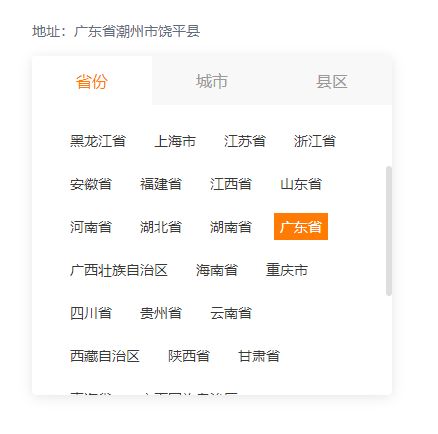

# 简介
一个适用于PC端的地区选择Vue组件 😆🌏


<br>

# 引入
这只是一个Vue组件，直接将areaPicker文件夹拷贝到你的Vue项目中的components目录下，并在需要的页面中引入并注册为一个组件即可！
如：
```javascript
import areaPicker from '@/components/areaPicker/index' // 文件对应路径

export default {
    components: {
        areaPicker
    },
}

```
<br>

# 使用

columns的值可以改变地区的选择范围，默认为3列，分别为 省/市/区县

```HTML
<p>地址：{{ areaName }}</p>
<area-picker
    ref="picker"
    v-model="area"
    :columns="3"
    @pick="handlePick"
/>
```
```javascript
data(){
    return {
        area: [],
        areaName: '',
    }
},

methods: {
    handlePick(areaList){
        this.areaName = areaList.map((item) => item.name).join('');
    }
}
```


🔨 常用方法：包裹在一个弹窗组件里面，组成一个弹出式的地区选择器。

<br>

# API
### area-picker Attributes

参数 | 说明 | 类型 | 可选值 | 默认值
|  ----  | ----  | ----  | ----  | ----  |
v-model | 绑定值，地区的对应code | Array | - | -
columns | 可选择的地区列数，分别为 省/市/区县 | Number | [1-3] | 3
width | 选择器的宽度（默认单位为px） | [Number, String] | - | 360
height | 选择器的高度（单位为px） | Number | - | 290

<br>

### area-picker Events


事件名称 | 说明 |  回调参数  |
----  | ----  | ----  |
pick | 当点击选择任意一个地址时触发 | 当前选择的地区数组，如：[{ code: 110000, name: '北京市' }...]
pick-province | 选择省级时触发 | { code: xxx, name: '选中的省' }
pick-city | 选择城市时触发 | { code: xxx, name: '选中的城市' }
pick-county | 选择区/县时触发 | { code: xxx, name: '选中的区/县' }

<br>

### area-picker Methods

方法名 | 说明 |  参数  |
----  | ----  | ----  |
getAreaNameList | 获取当前地址code对应的中文名，返回一个数组 | 地址code数组，如：['110000', '111000', '111001']
